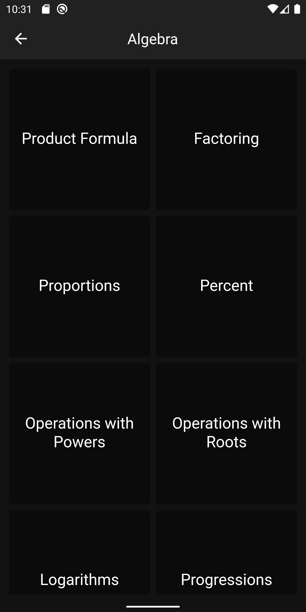
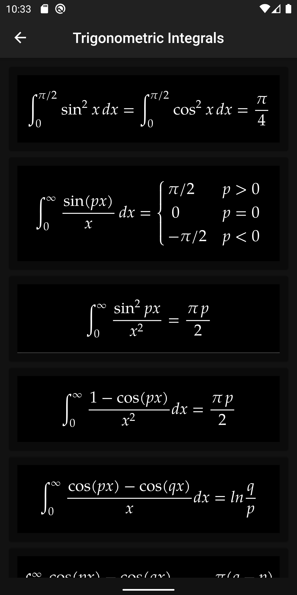

# mathsformulas

A simple flutter Hyrid application which contains 1000+ maths formulas. this app is designed using neumorphism design pattern and 
sqlite database as a backend.

Screens : 

{:height="20%" width="20%"}  {:height="20%" width="20%"}   {:height="20%" width="20%"}
